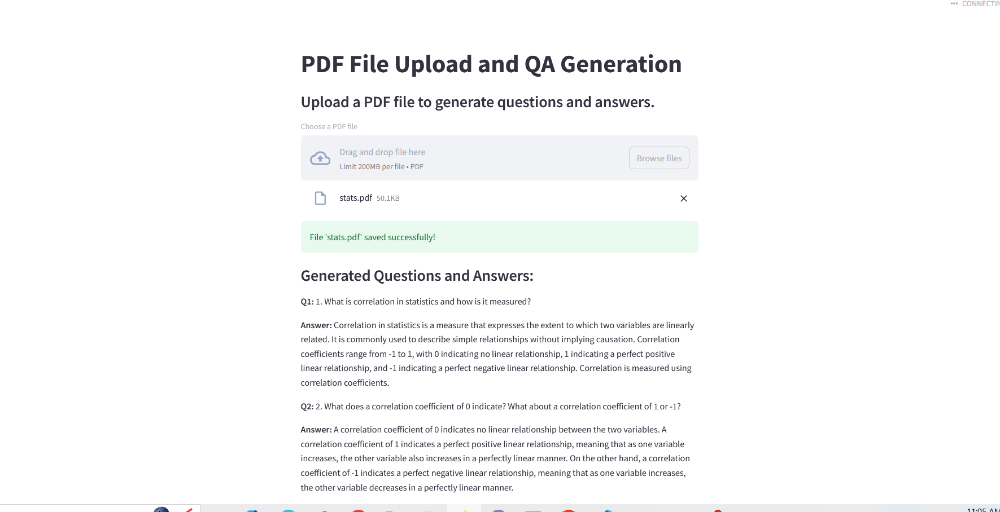
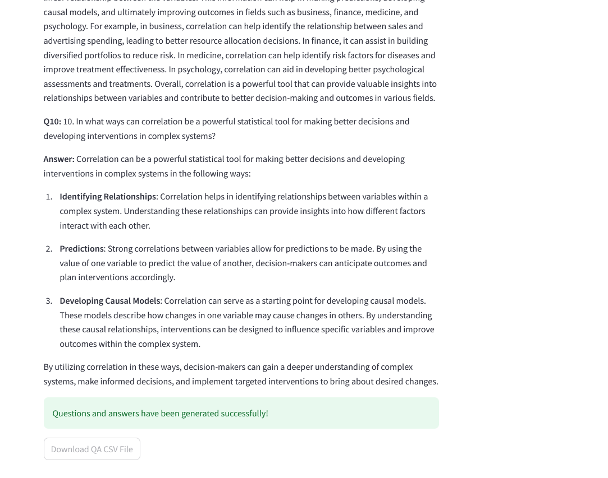
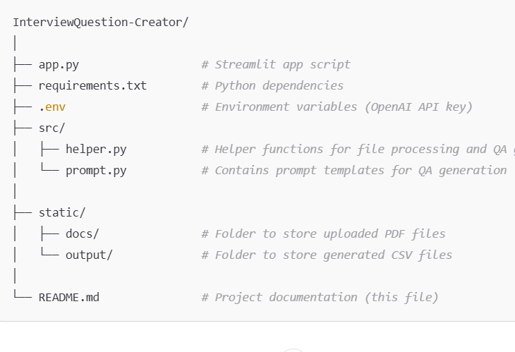

# InterviewQuestion-Creator

This project is a **Question & Answer** web application built using **Streamlit**, **Langchain**, and **FAISS**. The app allows users to upload a **PDF file**, from which it generates questions and answers. It processes the content of the PDF, splits the text into chunks, and uses **OpenAI's GPT** model for generating meaningful questions and answers. The results are saved into a **CSV file** that can be downloaded by the user.

## Demo

Here is a screenshot showing the app's result in action:

## Features

- **Upload PDF**: Upload a PDF file containing text.
- **Generate QA**: The system processes the content, generates questions, and then answers them.
- **Download Results**: The generated questions and answers are saved in a CSV file that can be downloaded.

## Requirements

- Python 3.10+
- Streamlit
- Langchain
- FAISS
- OpenAI API
- Python-dotenv
- Additional libraries in `requirements.txt`

## Installation Guide

Follow the steps below to set up the project locally:

### . Clone the Repository

git clone https://github.com/yourusername/InterviewQuestion-Creator.git

###   Set Up a Virtual Environment

python3 -m venv venv

venv\Scripts\activate

###  Install the Required Dependencies

pip install -r requirements.txt

### Set Up Environment Variables

OPENAI_API_KEY=your-openai-api-key

### Run the app
streamlit run app.py

### Project structure

## How to Use

### Upload PDF and Generate QA

1. **Upload a PDF**:
   - Click on the **"Upload PDF"** button.
   - Upload a PDF file containing text from which you want to generate questions and answers.

2. **Generate Questions and Answers**:
   - After the file is uploaded, the system processes the content of the PDF and generates relevant questions.
   - The generated questions and answers are displayed on the screen.

3. **Download the Result**:
   - The generated questions and answers are saved into a **CSV file**.
   - Click the **Download CSV** link to download the results.

